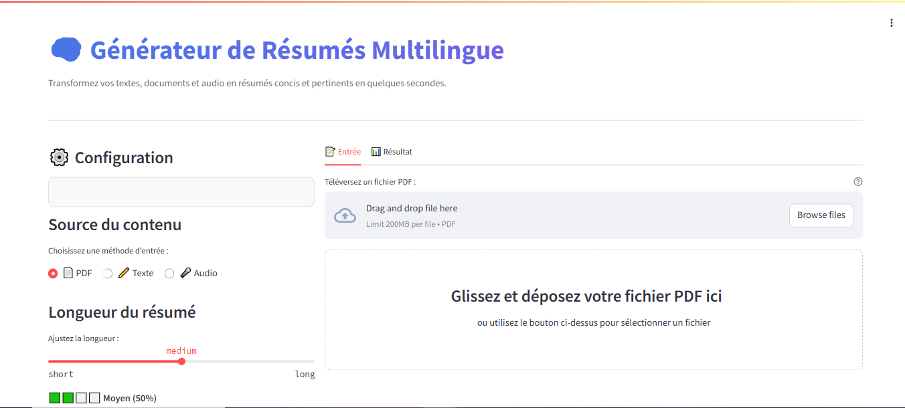
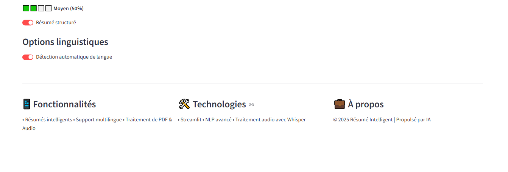

# 🧠 Générateur de Résumés Multilingue

**Ce générateur de résumé**  transforme vos textes, documents PDF et fichiers audio en résumés clairs et pertinents, générés en quelques secondes. Il s'appuie sur des technologies avancées d’intelligence artificielle et de traitement automatique du langage naturel pour analyser le contenu, en extraire les idées essentielles et les restituer sous une forme concise et structurée.

Compatible avec de nombreux formats d’entrée et plusieurs langues, l’outil détecte automatiquement la langue du contenu et s’adapte au type de support fourni (texte brut, document PDF ou audio). Il offre ainsi une solution puissante, rapide et accessible pour synthétiser efficacement l’information.

### Interface principale

*### Démonstration en action*
**

*Processus complet : de l'upload à la génération du résumé*

## ✨ Fonctionnalités principales

- ✅ **Traitement multi-format** : Texte, PDF, Audio (MP3, WAV, FLAC, etc.)
- ✅ **Support multilingue** : Français, Anglais, Arabe, Espagnol, Allemand
- ✅ **Détection automatique de langue** avec langdetect
- ✅ **Résumés structurés** avec points clés et conclusions
- ✅ **Transcription audio** avec OpenAI Whisper
- ✅ **Interface moderne** avec Streamlit
- ✅ **Longueurs personnalisables** (court, moyen, long)
- ✅ **Export et copie** des résultats
- 🔄 **Horodatage audio** (en développement)

